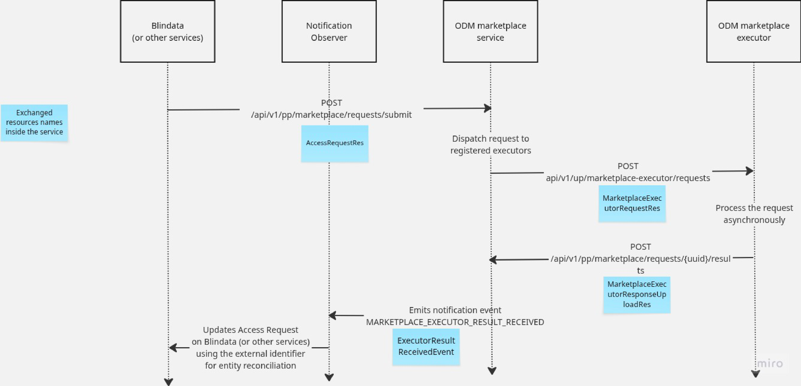

# ODM Platform Marketplace Server

The Open Data Mesh Platform's Marketplace service server is a Spring Boot application that provides marketplace
functionality for the Open Data Mesh Platform.

<!-- TOC -->

* [ODM Platform Marketplace Server](#odm-platform-marketplace-server)
    * [Overview](#overview)
    * [Core Functionalities](#core-functionalities)
        * [Access Request Management](#access-request-management)
    * [Prerequisites](#prerequisites)
    * [Setup Instructions](#setup-instructions)
        * [1. Database Configuration](#1-database-configuration)
            * [PostgreSQL (Production)](#postgresql-production)
            * [H2 (Development)](#h2-development)
        * [2. Building the Project](#2-building-the-project)
        * [3. Running the Application](#3-running-the-application)
            * [Local Development](#local-development)
            * [Docker Deployment](#docker-deployment)
    * [Configuration Options](#configuration-options)
        * [Application Properties](#application-properties)
            * [Server Configuration](#server-configuration)
            * [Spring Configuration](#spring-configuration)
            * [Database Configuration](#database-configuration)
            * [Flyway Database Migration](#flyway-database-migration)
            * [ODM Platform Configuration](#odm-platform-configuration)
            * [Logging Configuration](#logging-configuration)
        * [Docker Spring JSON Configuration](#docker-spring-json-configuration)
        * [Environment Variables](#environment-variables)
    * [API Documentation](#api-documentation)
    * [Contributing](#contributing)
    * [License](#license)
    * [Support](#support)
    * [Acknowledgments](#acknowledgments)

<!-- TOC -->

## Overview

This service is part of the Open Data Mesh Platform initiative, providing marketplace capabilities for data products and
services.

## Core Functionalities

### Access Request Management

The marketplace server provides a complete workflow for managing access requests, from initial submission through
executor processing to final response handling. The following sequence diagram illustrates the interaction flow:



#### Access Request Submission Flow

1. **External Service Submission**: An external service submits a new access request via
   `POST /api/v1/pp/marketplace/requests/submit` with the access request details. The `identifier` field contains an
   external identifier that can be used to reconcile the request with the external service.

2. **Request Processing**: The marketplace server validates the request and checks for duplicates. If valid, the access
   request is stored and assigned a unique UUID. It is recommended to use the marketplace's internal UUIDs to reference
   access requests within the platform, as an access request's natural key is the combination of the external identifier
   and the operation.

3. **Executor Forwarding**: The marketplace server forwards the access request to one or more configured marketplace
   executors. The system attempts to submit to active executors until one successfully accepts the request. The request
   is sent as a `MarketplaceExecutorRequestRes` object, which contains the access request UUID in the
   `request.identifier` field.

4. **Response Return**: Upon successful submission to at least one executor, the marketplace server returns the created
   access request (including its UUID) to the client with HTTP status 201 (Created).

#### Executor Response Handling Flow

1. **Response Reception**: After processing the access request, the executor sends its response back to the marketplace
   server via `POST /api/v1/pp/marketplace/requests/{uuid}/results`, where `{uuid}` is the access request UUID that was
   received during submission.

2. **Response Processing**: The marketplace server validates that the response corresponds to the original access
   request and stores the executor response.

3. **Notification**: The marketplace server sends a notification event to the notification service to inform other
   system components about the completed executor response.

4. **Success Response**: The endpoint returns HTTP status 200 (OK) upon successful processing.

#### API Endpoints

- `POST /api/v1/pp/marketplace/requests/submit` - Submit a new access request
- `POST /api/v1/pp/marketplace/requests/{uuid}/results` - Handle executor response for an access request
- `GET /api/v1/pp/marketplace/requests/{id}` - Retrieve an access request by UUID
- `GET /api/v1/pp/marketplace/requests` - Search and list access requests
- `DELETE /api/v1/pp/marketplace/requests/{id}` - Delete an access request

#### External System Interactions

- **Marketplace Executors**: External services that process access requests. The marketplace server forwards requests to
  executors and receives their responses.
- **Notification Service**: External service that receives events when executor responses are processed, enabling other
  system components to react to access request completions.

## Prerequisites

- Java 11 or higher
- Maven 3.6 or higher
- PostgreSQL (for production) or H2 (for development)

## Setup Instructions

### 1. Database Configuration

#### PostgreSQL (Production)

```properties
# application.properties
spring.datasource.url=jdbc:postgresql://localhost:5432/marketplace
spring.datasource.username=your_username
spring.datasource.password=your_password
spring.jpa.properties.hibernate.dialect=org.hibernate.dialect.PostgreSQLDialect
```

#### H2 (Development)

```properties
# application.properties
spring.datasource.url=jdbc:h2:mem:marketplace
spring.datasource.driverClassName=org.h2.Driver
spring.datasource.username=sa
spring.datasource.password=
spring.jpa.database-platform=org.hibernate.dialect.H2Dialect
```

### 2. Building the Project

```bash
# Clone the repository
git clone https://github.com/opendatamesh-initiative/odm-platform-pp-marketplace-server.git

# Navigate to project directory
cd odm-platform-pp-marketplace-server

# Build the project
mvn clean install
```

### 3. Running the Application

#### Local Development

```bash
# Run with default configuration
mvn spring-boot:run

# Run with specific profile
mvn spring-boot:run -Dspring-boot.run.profiles=dev
```

#### Docker Deployment

```bash
# Build the Docker image
docker build -t odm-marketplace-server .

# Run the container
docker run -p 8080:8080 \
  -e SPRING_DATASOURCE_URL=jdbc:postgresql://db:5432/marketplace \
  -e SPRING_DATASOURCE_USERNAME=your_username \
  -e SPRING_DATASOURCE_PASSWORD=your_password \
  odm-marketplace-server
```

## Configuration Options

### Application Properties

The application can be configured using the following properties in `application.yml` or `application.properties`:

#### Server Configuration

```yaml
server:
  port: 8080  # The port on which the application will run
```

#### Spring Configuration

```yaml
spring:
  application:
    name: odm-platform-pp-marketplace-server
  banner:
    charset: UTF-8
    mode: console
```

#### Database Configuration

```yaml
spring:
  datasource:
    url: jdbc:postgresql://localhost:5432/marketplace  # Database connection URL
    username: your_username                            # Database username
    password: your_password                            # Database password
  jpa:
    properties:
      hibernate:
        default_schema: marketplace_data              # Default schema for database tables
```

#### Flyway Database Migration

```yaml
spring:
  flyway:
    baselineOnMigrate: true                           # Allow baseline migrations
    locations: classpath:db/migration/postgresql      # Location of migration scripts
    schemas: public                                   # Target schema for migrations
    validateOnMigrate: false                          # Skip validation during migration
    outOfOrder: true                                  # Allow out-of-order migrations
```

#### ODM Platform Configuration

```yaml
odm:
  product-plane:
    notification-service:
      address: http://localhost:8083                  # Notification service URL
      active: true                                    # Enable/disable notification service
  utility-plane:
    marketplace-executors: # List of marketplace executors
      - name: EXEC-001                               # Executor name
        address: http://localhost:8080               # Executor URL
        active: true                                 # Enable/disable executor
```

#### Logging Configuration

```yaml
logging:
  pattern:
    console: "%clr(%d{yyyy-MM-dd HH:mm:ss.SSS}){faint} %clr(%5p) %clr(${PID:- }){magenta} %clr(---){faint} %clr([%15.15t]){faint} %clr(%-40.40logger{39}){cyan} %clr(:){faint} %m%n%wEx"
    file: "%d{yyyy-MM-dd HH:mm:ss.SSS} [%thread] %-5level %logger{36} - %msg%n"
  level:
    org.springframework.web.filter.CommonsRequestLoggingFilter: DEBUG
```

These properties can be overridden using environment variables or command-line arguments when running the application.

### Docker Spring JSON Configuration

When running the application in Docker, you can pass the Spring configuration as a JSON string using the `SPRING_PROPS`
environment variable. Here's an example:

```bash
docker run -p 8080:8080 \
  -e SPRING_PROPS='{"spring":{"datasource":{"url":"jdbc:postgresql://db:5432/marketplace","username":"your_username","password":"your_password"},"jpa":{"properties":{"hibernate":{"default_schema":"marketplace_data"}}}},"odm":{"product-plane":{"notification-service":{"address":"http://notification-service:8083","active":true}},"utility-plane":{"marketplace-executors":[{"name":"EXEC-001","address":"http://executor:8080","active":true}]}}}' \
  odm-marketplace-server
```

The JSON structure follows the same hierarchy as the YAML configuration:

```json
{
  "spring": {
    "datasource": {
      "url": "jdbc:postgresql://db:5432/marketplace",
      "username": "your_username",
      "password": "your_password"
    },
    "jpa": {
      "properties": {
        "hibernate": {
          "default_schema": "marketplace_data"
        }
      }
    }
  },
  "odm": {
    "product-plane": {
      "notification-service": {
        "address": "http://notification-service:8083",
        "active": true
      }
    },
    "utility-plane": {
      "marketplace-executors": [
        {
          "name": "EXEC-001",
          "address": "http://executor:8080",
          "active": true
        }
      ]
    }
  }
}
```

This approach is particularly useful when you need to configure multiple properties at once in a Docker environment, as
it allows you to pass all configuration in a single environment variable.

### Environment Variables

The application can be configured using environment variables:

- `SPRING_PROFILES_ACTIVE`: Set active profile (dev, prod)
- `SPRING_DATASOURCE_URL`: Database connection URL
- `SPRING_DATASOURCE_USERNAME`: Database username
- `SPRING_DATASOURCE_PASSWORD`: Database password
- `SERVER_PORT`: Application port
- `SERVER_SERVLET_CONTEXT_PATH`: API context path

## API Documentation

Once the application is running, you can access:

- Swagger UI: `http://localhost:8080/swagger-ui.html`
- OpenAPI Specification: `http://localhost:8080/api-docs`

## Contributing

1. Fork the repository
2. Create your feature branch (`git checkout -b feature/amazing-feature`)
3. Commit your changes (`git commit -m 'Add some amazing feature'`)
4. Push to the branch (`git push origin feature/amazing-feature`)
5. Open a Pull Request

## License

This project is licensed under the Apache License 2.0 - see the [LICENSE](LICENSE) file for details.

## Support

For support, please open an issue in the GitHub repository.

## Acknowledgments

- Open Data Mesh Initiative
- All contributors to this project 